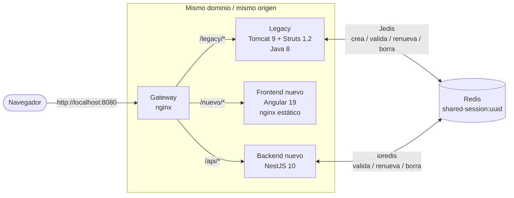
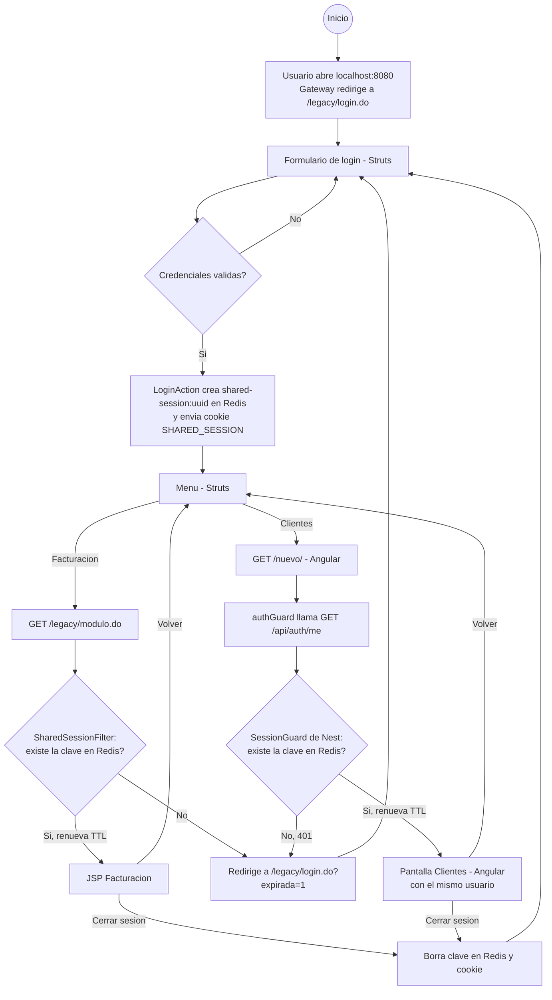
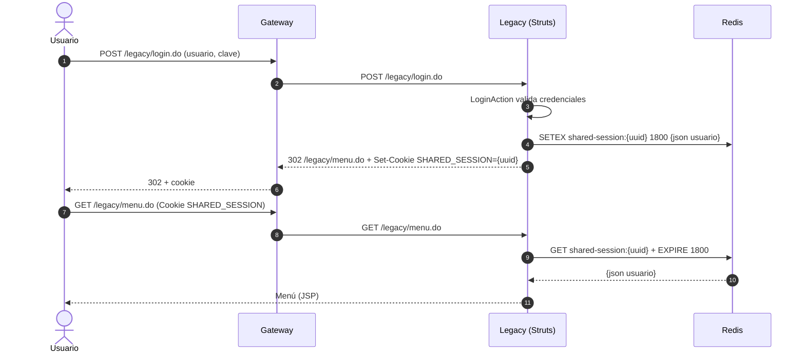
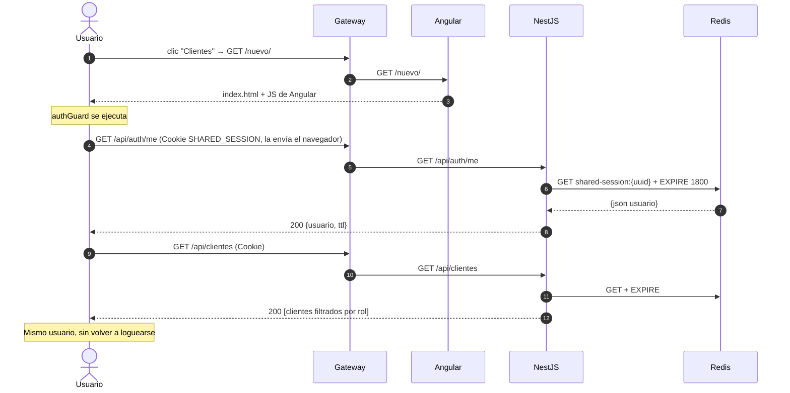
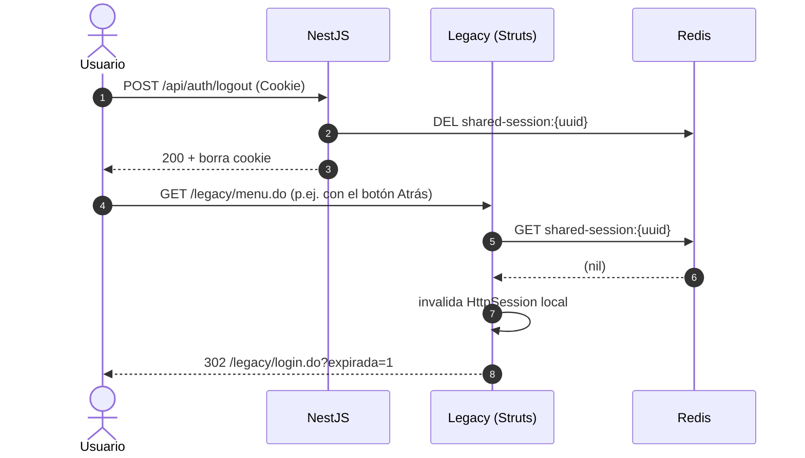
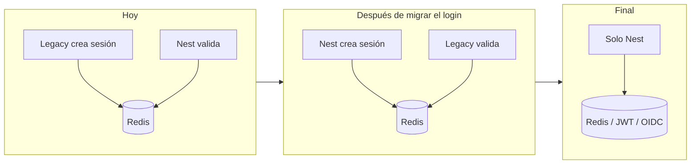

# Sesión compartida: Legacy (Struts 1.2) ↔ Migración (Angular + NestJS)

Ejemplo mínimo de cómo hacer convivir un sistema **legacy en Java Struts 1.2** con su **migración en Angular + NestJS**, compartiendo **la misma sesión** mediante **Redis**, mientras el legacy sigue en producción hasta que se apague.

- El **login** y el **menú** siguen viviendo en el legacy.
- El menú tiene 2 opciones:
  - **Facturación** → módulo que aún está en Java/Struts.
  - **Clientes** → módulo ya migrado a Angular + NestJS.
- Al entrar a **Clientes**, el usuario **no vuelve a iniciar sesión**: Angular/Nest reconocen la sesión creada por Struts.
- Cerrar sesión en cualquiera de los dos sistemas la cierra en ambos.

---

## 1. Contexto: patrón *Strangler Fig*

Migrar todo de una vez es arriesgado. Lo habitual es ir "estrangulando" el legacy: cada módulo nuevo se construye en el stack moderno, y el legacy sigue atendiendo lo que aún no se migra. Para el usuario debe verse como **un solo sistema**, lo que exige resolver dos problemas:

| Problema | Solución en este ejemplo |
|---|---|
| Dos aplicaciones en servidores distintos | Un **gateway (nginx)** que expone todo bajo **un mismo dominio** (`localhost:8080`) y enruta por path. |
| Cada una tiene su propia sesión (Tomcat `JSESSIONID` vs Node) | Una **sesión compartida en Redis**, en **JSON**, identificada por la cookie `SHARED_SESSION`. |

```
Fase 1 (hoy)            Fase 2 (este ejemplo)          Fase 3               Fase final
┌────────────┐          ┌────────────┬──────────┐      ┌────┬─────────────┐  ┌──────────────┐
│   Legacy   │   ──►    │   Legacy   │  Nuevo   │ ──►  │Leg.│    Nuevo    │  │    Nuevo     │
│  (todo)    │          │login, menú,│ clientes │      │    │ login, menú │  │   (todo)     │
└────────────┘          │ facturación│          │      └────┴─────────────┘  └──────────────┘
                        └────────────┴──────────┘
```

---

## 2. Arquitectura



| Servicio | Tecnología | Ruta pública | Responsabilidad |
|---|---|---|---|
| `gateway` | nginx | `/` | Punto de entrada único. Enruta por path. |
| `legacy` | Java 8, Struts 1.2.9, Tomcat 9, Jedis | `/legacy/*` | Login, menú, módulo Facturación. **Crea** la sesión. |
| `web` | Angular 19 (standalone) | `/nuevo/*` | Pantallas del módulo migrado (Clientes). |
| `api` | NestJS 10, ioredis | `/api/*` | API del módulo migrado. **Valida** la sesión. |
| `redis` | Redis 7 | — | Almacén de la sesión compartida. |

### ¿Por qué un gateway con un mismo dominio?

Las cookies se envían por dominio + path. Si el legacy estuviera en `legacy.empresa.com:8080` y Angular en `app.empresa.com:4200`, la cookie creada por uno no llegaría al otro (y aparecerían problemas de CORS y `SameSite`). Con el gateway, el navegador ve **un solo origen**, y la cookie `SHARED_SESSION` con `Path=/` viaja a `/legacy`, `/nuevo` y `/api`.

> En producción el gateway puede ser el balanceador existente (F5, Apache, nginx, ALB, Ingress…). Alternativa: subdominios con `Domain=.empresa.com` en la cookie.

---

## 3. La sesión compartida

### Cookie

```
SHARED_SESSION=6f1c...-uuid; Path=/; HttpOnly; SameSite=Lax
```

- `HttpOnly`: JavaScript (Angular) **no** puede leerla → protege contra robo por XSS. Angular no la necesita: el navegador la envía sola.
- `Path=/`: se envía a todos los sistemas del dominio.
- En producción agregar `Secure` (solo HTTPS).

### Valor en Redis

```
KEY   shared-session:6f1c...-uuid
TTL   1800 s (30 min, se renueva en cada request)
VALUE {"id":"6f1c...","userId":1,"username":"admin","nombre":"Ana Administradora",
       "roles":["ADMIN","USER"],"loginAt":1758100000000}
```

### ¿Por qué JSON y no la `HttpSession` de Java en Redis?

Existen librerías (Spring Session, Redisson Tomcat Session Manager) que guardan la `HttpSession` completa en Redis, pero usan **serialización binaria de Java**, que Node.js no puede leer. Además la `HttpSession` del legacy suele tener de todo (form beans, listas, objetos de negocio).

Por eso se define un **contrato mínimo en JSON** con solo lo necesario para identificar y autorizar al usuario. El legacy sigue usando su `HttpSession` local de Tomcat como siempre para lo demás; **Redis es la fuente de verdad de "quién está autenticado"**.

### Reglas

| Evento | Legacy (Struts) | Nuevo (Nest) |
|---|---|---|
| Login | `LoginAction` crea la clave en Redis + cookie | — (no tiene login propio) |
| Cada request | `SharedSessionFilter`: valida y renueva TTL | `SessionGuard`: valida y renueva TTL |
| Sesión no existe | invalida `HttpSession` y redirige a login | responde `401` → Angular redirige al login legacy |
| Logout | `LogoutAction` borra la clave | `POST /api/auth/logout` borra la clave |

Como ambos renuevan el TTL (**expiración deslizante**), si el usuario trabaja 1 hora solo en Angular, la sesión sigue viva cuando vuelve al legacy.

---

## 4. Flujograma de navegación



---

## 5. Diagramas de secuencia

### 5.1 Login en el legacy



### 5.2 Ir al módulo migrado con la misma sesión



### 5.3 Logout desde Angular y vuelta al legacy



### 5.4 Expiración por inactividad

Si pasan 30 min sin requests a ninguno de los dos sistemas, Redis elimina la clave por TTL. El siguiente request al legacy redirige al login; el siguiente request a la API responde `401` y el interceptor de Angular redirige al login del legacy.

---

## 6. Estructura del proyecto

```
double-session/
├── docker-compose.yml
├── gateway/nginx.conf                       # reverse proxy: /legacy, /nuevo, /api
├── legacy-struts/                           # Java 8 + Struts 1.2.9 (Maven → legacy.war)
│   └── src/main/
│       ├── java/com/ejemplo/legacy/
│       │   ├── session/RedisSessionStore.java    # ★ lee/escribe la sesión JSON en Redis
│       │   ├── session/SharedSessionCookie.java  # ★ cookie SHARED_SESSION
│       │   ├── session/SharedSessionFilter.java  # ★ valida la sesión en cada *.do
│       │   ├── action/LoginAction.java           # ★ crea la sesión compartida
│       │   ├── action/LogoutAction.java          # ★ la elimina
│       │   ├── action/MenuAction.java
│       │   ├── action/ModuloLegacyAction.java
│       │   └── form/LoginForm.java
│       └── webapp/WEB-INF/{web.xml, struts-config.xml, jsp/*.jsp}
├── api-nest/                                # NestJS
│   └── src/
│       ├── session/session.service.ts       # ★ mismo contrato que RedisSessionStore.java
│       ├── session/session.guard.ts         # ★ equivalente al SharedSessionFilter
│       ├── auth/auth.controller.ts          # GET /api/auth/me, POST /api/auth/logout
│       └── clientes/clientes.controller.ts  # endpoint protegido de ejemplo
└── web-angular/                             # Angular 19 (base-href /nuevo/)
    └── src/app/
        ├── auth.service.ts                  # consulta /api/auth/me
        ├── auth.guard.ts                    # ★ bloquea rutas sin sesión
        ├── session.interceptor.ts           # ★ 401 → login del legacy
        └── clientes.component.ts            # pantalla del módulo migrado
```

★ = piezas que implementan la sesión compartida. **En el legacy real solo se agregan el filtro, 2 clases utilitarias y cambios en login/logout**; el resto de la aplicación no se toca.

---

## 7. Cómo ejecutarlo

Requisitos: Docker Desktop.

```bash
docker compose up --build
```

Abrir **http://localhost:8080** (la primera compilación tarda unos minutos: Maven + npm).

| Usuario | Clave | Roles | En "Clientes" ve |
|---|---|---|---|
| `admin` | `admin` | ADMIN, USER | todos los clientes |
| `user` | `user` | USER | solo sus clientes |

### Prueba guiada

1. Iniciar sesión con `admin/admin` → aparece el menú del legacy.
2. **Facturación** → página JSP renderizada por Struts.
3. **Volver al menú** → **Clientes** → pantalla Angular con el **mismo usuario y el mismo id de sesión**, sin login.
4. **Cerrar sesión** en Angular → vuelve al login legacy. Presionar *Atrás* e intentar entrar al menú → pide login (la sesión se cerró en ambos).
5. Abrir `http://localhost:8080/nuevo/` en una ventana de incógnito → redirige al login del legacy.

### Inspeccionar Redis

```bash
docker compose exec redis redis-cli keys "shared-session:*"
```

```bash
docker compose exec redis redis-cli get "shared-session:<uuid>"
```

```bash
docker compose exec redis redis-cli ttl "shared-session:<uuid>"
```

Para simular expiración, borrar la clave a mano (`redis-cli del ...`) y navegar en cualquiera de los dos sistemas.

---

## 8. Consideraciones para producción

- **HTTPS** y cookie con `Secure`.
- **Redis con alta disponibilidad** (Sentinel / Cluster / servicio gestionado) y con password/TLS: si Redis cae, nadie puede autenticarse.
- **Contrato de sesión versionado**: el JSON es una API entre dos equipos; agregar campos es seguro, renombrar/eliminar no. Se puede incluir un campo `"v": 1`.
- **No guardar datos sensibles** ni objetos grandes en la sesión compartida; solo identidad y roles. Los datos de negocio se consultan a la BD/API.
- **Rotar el id de sesión** en el login (ya se hace) para evitar *session fixation*.
- **CSRF**: con `SameSite=Lax` los POST cross-site no llevan la cookie; para mayor seguridad agregar token CSRF (p. ej. patrón *double submit cookie*) en los endpoints que modifican datos.
- **Timeout único**: alinear el `session-timeout` de Tomcat con el TTL de Redis (aquí ambos 30 min).
- **Autorización**: el legacy es quien carga roles/permisos al hacer login; Nest los lee de la sesión. Cuando cambien los permisos de un usuario, basta con borrar su clave para forzar re-login.
- **Revocación masiva / auditoría**: guardar además un set `user-sessions:{userId}` con sus ids permite cerrar todas las sesiones de un usuario.
- **Alternativa con JWT**: el legacy podría emitir un JWT firmado en vez de un id opaco. Evita consultar Redis, pero **no permite logout inmediato** sin una lista de revocación (que volvería a necesitar Redis). Para convivencia legacy/nuevo, la sesión opaca en Redis es más simple y controlable.

### Cómo se apaga el legacy al final

1. Se migran módulos uno a uno; el menú del legacy apunta cada vez más a `/nuevo/...`.
2. Se migran **login y menú** a Angular/Nest: ahora **Nest crea** la clave `shared-session:*` con el mismo JSON, y el `SharedSessionFilter` del legacy la sigue validando sin cambios.
3. Cuando el último módulo legacy se migra, se elimina la ruta `/legacy/` del gateway y se apaga Tomcat. Redis puede seguir como almacén de sesiones del sistema nuevo (o reemplazarse por JWT/OIDC).


